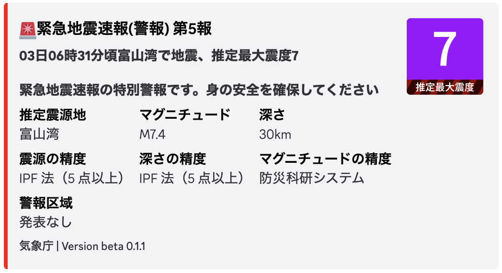

# Earth Said BOT

<div style="text-align: center;">
    
</div>
※実際のものではありません

> [!WARNING]
>## 始める前に
> プログラミング弱者が作ったコードなのでエラーが発生する可能性があります。
> 環境によっては起動できない可能性があります。

## 環境構築

> [!WARNING]
> python3 がインストールされている前提です。

### クローン

GitHub からリポジトリをクローンします。

```bash
git clone https://github.com/nikkou-0814/Earth-Said-BOT.git
```

### 環境変数

1. .env をコピーします。

```bash
cp .env.example .env
```

Discord BOT のトークンとチャンネルIDを記載します。

2. TOKEN=<DISOCRD_TOKEN>

3. ChannelID=<DISCORD_ChannelID>

## 依存関係のインストールと起動

```bash
pip install -r requirements.txt
```
```bash
python bot.py
```

## ```testdata.json```の記述(wolfx APIの仕様に基づく)
### このリポジトリを改造、改良する方向け

| **項目**                 | **説明**                           | **コード内で使用しているか** |
|-------------------------|------------------------------------|------------------------|
| **type**                | JMA_EEW                            | NO                     |
| **title**               | 緊急地震速報                         | NO                     |
| **codeType**            | 緊急地震速報の説明                    | NO                     |
| **issueSource**         | 発表機関                            | NO                     |
| **issueStatus**         | 発表の状態                          | NO                     |
| **eventID**             | イベントID                          | NO                     |
| **serial**              | 発表回数                            | YES                    |
| **announcedTime**       | 発表時間                            | YES                    |
| **originTime**          | 地震発生時間                         | YES                    |
| **hypocenter**          | 震源地                              | YES                    |
| **latitude**            | 震源地の緯度                         | NO                     |
| **longitude**           | 震源地の経度                         | NO                     |
| **magnitude**           | マグニチュード                       | YES                    |
| **depth**               | 震源の深さ                          | YES                    |
| **maxIntensity**        | 最大震度                             | YES                   |
| **accuracyEpicenter**   | 震央の精度に関する説明               | NO                      |
| **accuracyDepth**       | 震源の深さの精度に関する説明         | NO                       |
| **accuracyMagnitude**   | マグニチュードの精度に関する説明     | NO                        |
| **maxIntChangeString**  | 最大震度の変更に関する説明           | NO                       |
| **maxIntChangeReason**  | 最大震度の変更理由                   | NO                     |
| **warnAreaChiiki**      | 警報が出される地域                   | YES                    |
| **warnAreaShindo1**     | 地域の最大震度                       | NO                     |
| **warnAreaShindo2**     | 地域の最小震度                       | NO                     |
| **warnAreaTime**        | 警報が出された時間                   | NO                     |
| **warnAreaType**        | 警報の種類（「予報」または「警報」） | YES                       |
| **warnAreaArrive**      | 地震波が到達したかどうか             | NO                      |
| **isSea**               | 海域で発生した地震かどうか           | NO                      |
| **isTraining**          | 訓練用の速報かどうか                 | NO                     |
| **isAssumption**        | 推定震源（PLUM法、レベル法、IPF法）かどうか | YES                |
| **isWarn**              | 警報かどうか                         | YES                   |
| **isFinal**             | 最終報かどうか                       | YES                   |
| **isCancel**            | 取消報かどうか                       | YES                   |
| **originalText**        | 気象庁からの原文                     | NO                    |

## 注意
このリポジトリを使用する際に発生した<ins>損害については、私は責任を負いません</ins>。十分に注意してご利用ください。

> [!WARNING]
>## テストデータに関する注意
>テストデータは2024年6月3日午前6時31分頃発生した石川県能登地方を震源とする最大震度5強を観測した地震のデータです。
>
>テストデータは本来開発をしやすくする目的で導入しています。（```@silent```でのメッセージするようにしています。）
>
>このリポジトリ内のプログラムを改造してテストデータであることを知らせる記述を削除し、
>サーバーメンバーを混乱させる行為は絶対にしないでください。

## 謝礼

### 地震情報API > P2PQuake JSON API v2

### 緊急地震API > wolfx API

### テストデータ > dmdata.jp 緊急地震速報イベント一覧 より一部改変